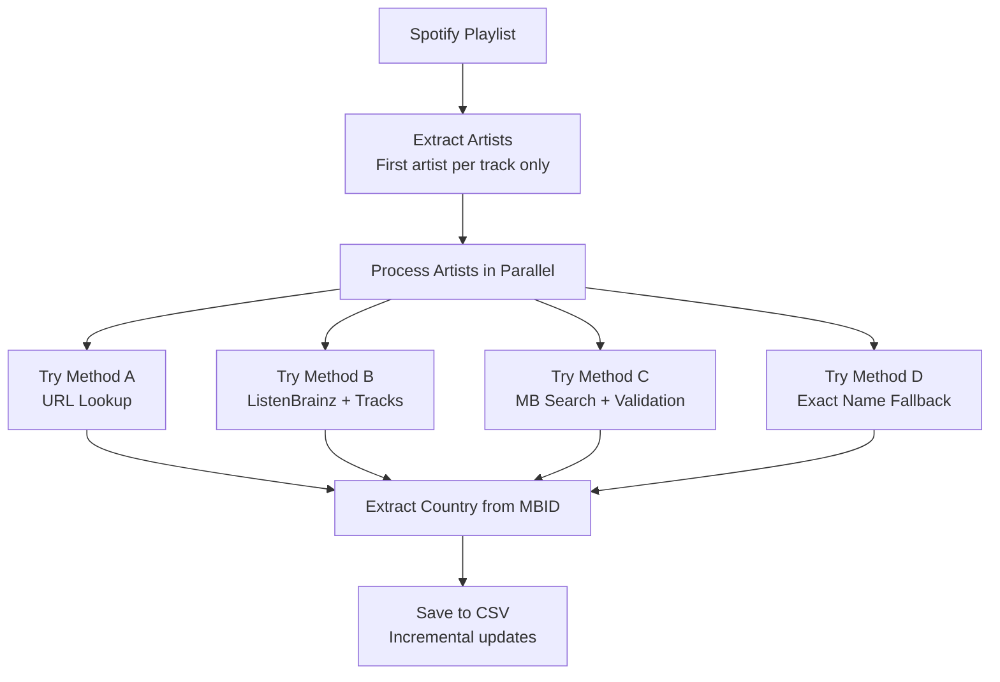

# Spotify Artist/Band Country Extractor and Mapper

## How It Works - Overview and Detailed Explanation

### Overview

It follows a tree approach to resolve artist origin country:
1. Direct Spotify URL Lookup (Fastest when available)
2. ListenBrainz Metadata Lookup (Using artist's top tracks)
3. MusicBrainz Search with Validation (Most comprehensive, with scoring and validation)
4. Unique Exact-Name Fallback (Conservative fallback)

Once an artist's MusicBrainz ID (MBID) is found, the tool extracts country information from:
- Direct country field
- Disambiguation text analysis
- Area relationships
- Location name inference

### Overview Flowchart


---

### Detailed Detailed Step-by-Step Process

#### **Phase 1: Data Extraction & Setup**
1. **Configuration**: Sets up Spotify API credentials, cache settings, rate limits, and concurrency parameters
2. **Spotify Client**: Initializes Spotipy client with OAuth credentials
3. **SQLite Cache**: Creates a thread-safe write-behind cache for API responses
4. **NLP**: Attempts to load language detection and translation libraries

#### **Phase 2: Playlist Processing**
**Step 01**: Extracts unique artists from Spotify playlist
- Only takes the FIRST artist for each track (ignores collaborations)
- Returns list of dicts with `artist_name` and `spotify_link`

#### **Phase 3: Per-Artist Resolution Ladder (Step 16)**
For each artist, tries methods in order:
##### **Step 16A**: MusicBrainz URL Lookup
- Direct query to MusicBrainz using Spotify artist link
- Returns MBID if exactly one match found
- Fastest method when available
##### **Step 16B**: ListenBrainz Metadata Lookup

- Uses artist's top tracks from Spotify
- Queries ListenBrainz API with artist + track combinations
- Optionally tries translated artist name (if NLP available)
- Rate limited to 0.2 seconds between calls

##### **Step 16C**: MusicBrainz Search with Validation
Most complex step with multiple sub-steps:
1. **Search**: Queries MusicBrainz with artist name (and optionally translated name)
2. **Scoring**: Scores each candidate based on:
    - Name similarity (Jaccard similarity, exact matches)
    - Alias matches (especially English aliases)
    - Artist type (groups get bonus)
    - Disambiguation text analysis
3. **Validation**: Strict validation of top candidates (TOP_N=2):
    - Name sanity gate (strict token matching)
    - Spotify URL relations check (if score ≥ 60)
    - ISRC matching via recordings (check top tracks)
    - Recording title matching (1-2 tracks required)
4. **Return**: First validated candidate with highest score

##### **Step 16D**: Unique Exact-Name Fallback
- Searches for exact name matches in MusicBrainz
- Returns result only if exactly ONE artist matches exactly
- Conservative fallback to avoid mismatches

##### **Step 16E**: Return Best Available
- Returns whatever partial data was found in previous steps
- Prioritizes: Step 16B partial → Step 16C partial → Step 16A partial

#### **Phase 4: Country Extraction**

Once MBID is obtained:
- Queries MusicBrainz artist endpoint with `area-rels` inclusion
- Extracts country from:
    1. Direct `country` field
    2. Disambiguation text (NLP analysis)
    3. Begin-area/area names
    4. Area relations
- Uses NLP to infer country from location names if needed

#### **Phase 5: Parallel Processing & Output**
- Processes artists concurrently (up to 8 threads)
- Saves progress every 25 artists
- Uses SQLite cache to avoid duplicate API calls
- Produces final CSV with columns:
    - `artist_name`, `spotify_link`, `mbid`, `country`, `method`

### Detailed Detailed Step-by-Step Process Flowchart

```mermaid
flowchart TD
    subgraph Input
        A[Start: Spotify Playlist URL]
    end
    
    subgraph Extraction
        B[Step 01: Extract Unique Artists]
        C[Get only FIRST artist per track]
        D[Create DataFrame with<br>artist_name & spotify_link]
    end
    
    A --> B --> C --> D
    
    subgraph ParallelProcessing[Parallel Processing]
        E[MAX_WORKERS=8]
    end
    
    D --> E
    
    E --> F{For each artist}
    
    subgraph MethodA[Method A: MB URL Lookup]
        G[Step 16A: MB URL Lookup]
        H{Single MBID found?}
        I[Get country from MB]
        J{Country found?}
    end
    
    F --> G
    G --> H
    H -->|Yes| I
    I --> J
    J -->|Yes| K[Return result<br>method='step16a_mb_url_single']
    
    H -->|No/multiple| L
    
    subgraph MethodB[Method B: ListenBrainz Lookup]
        L[Step 16B: ListenBrainz Lookup]
        M{MBID found?}
        N[Get country from MB]
        O{Country found?}
    end
    
    L --> M
    M -->|Yes| N
    N --> O
    O -->|Yes| P[Return result<br>with track info]
    
    M -->|No| Q
    
    subgraph MethodC[Method C: MB Search + Validation]
        Q[Step 16C: MB Search + Validation]
        R[Search with name/aliases]
        S[Score & validate candidates<br>TOP_N=2, MIN_SCORE=45]
        T{Valid MBID found?}
        U[Get country from MB]
        V{Country found?}
    end
    
    Q --> R --> S --> T
    T -->|Yes| U --> V
    V -->|Yes| W[Return result<br>method='step16c_mb_search']
    
    T -->|No| X
    
    subgraph MethodD[Method D: Unique Exact-Name Fallback]
        X[Step 16D: Unique Exact-Name Fallback]
        Y{Unique exact match?}
        Z[Get country from MB]
        AA{Country found?}
    end
    
    X --> Y
    Y -->|Yes| Z --> AA
    AA -->|Yes| AB[Return result<br>method='step16d_unique_exact']
    
    Y -->|No| AC[Step 16E: Return best partial]
    AC --> AD[Return whatever partial<br>data is available]
    
    J -->|No| AE[Continue to next method]
    O -->|No| AF[Continue to next method]
    V -->|No| AG[Continue to next method]
    AA -->|No| AH[Continue to next method]
    
    AE --> L
    AF --> Q
    AG --> X
    AH --> AC
    
    subgraph OutputCollection[Output Collection]
        AI[Collect Results]
    end
    
    K --> AI
    P --> AI
    W --> AI
    AB --> AI
    AD --> AI
    
    subgraph SaveProgress[Save Progress]
        AJ[Save every 25 artists]
        AK[Update CSV]
        AL[Flush SQLite cache]
    end
    
    AI --> AJ --> AK --> AL
    
    AL --> AM{All artists processed?}
    AM -->|No| E
    AM -->|Yes| AN[Final CSV Output]
    AN --> AO[End]

    class A,AO startEnd
    class B,C,D,E,G,I,L,N,Q,R,S,U,Z,AJ,AK,AL,AN process
    class H,J,M,O,T,V,Y,AA,AM decision
    class MethodA,MethodB,MethodC,MethodD method
    class SaveProgress save
```


`countries.csv` metadata:

| Column | Description |
| :--- | :--- |
| **artist_name** | Cleaned artist name |
| **spotify_link** | Spotify artist URL |
| **mbid** | MusicBrainz ID (if found) |
| **country** | 2-letter country code (if found) |
| **method** | Which resolution method succeeded |


---
## Usage

### 1. Clone the repository:
```python
git clone https://github.com/guptarjun117/spotify_mbid_country.git
cd artist-country-extractor
```

### 2. Install required packages:
```python
pip install requirements.txt
python -m spacy download en_core_web_sm
```

### 3. Setup `config.py`
- It requires 4 inputs from a user
  - Spotify Client ID
  - Spotify Client Secret
  - ListenBrainz User Token
  - Spotify Playlist Link

### 4. Run `main.py`

### 5. Open `artists_map_dashboard_dark.html` in a browser

### 6. NOTES:
- Get your own Spotify credentials at: https://developer.spotify.com/documentation/web-api.
- The current ListenBrainz credential should work as it. Otherwise get yours at: https://listenbrainz.readthedocs.io/en/latest/users/api/index.html.
- The entire pipeline will output `countries.csv` and `artists_map_dashboard_dark.html`.
- If `countries.csv` already exists in the directory, then it will skip eveything to just generate `artists_map_dashboard_dark.html`.
- Currently the directory contains my `countries.csv`. If you want the full pipline to run to generate the `csv` and `html` then simply delete the `countries.csv` and run the `main.py` again.
- The Spotify credentials are prone to timeouts. Use them wisely, avoiding repeated requests, as timeouts can last several hours (I was once timed out for ~8 hours).
- The entire pipeline could take some time to run, depending on the number of artists in your playlist. With 645 unique artists, it took around ~30 minutes. For testing, start with a smaller playlist.
- The pipeline attempts to use a translation library. Sometimes, an artist's name is in English on Spotify, such as **Aria** and **Tomioka Ai**, but it's stored in their country's language on the MusicBrainz database, Ария (RU) and 冨岡愛 (JP), respectively. However, in some cases, especially with CJK (Chinese-Japanese-Korean) languages, the translation may not work properly or as expected.
- SQLite for persistent caching.
- Concurrent processing: 8 threads by default.

---

## Contribution and Future Upgrades
The entire pipeline can be made more efficient, and upgrades can be made to the translation and other components. Contributions are welcome.
